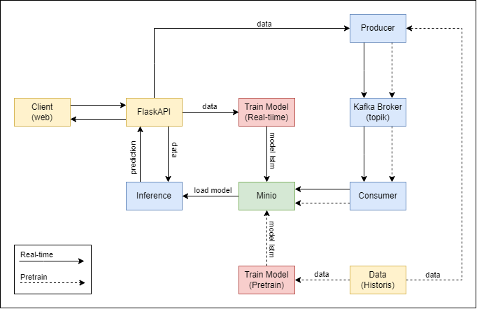

# Kafka project

## Arsitektur


run docker
```bash
docker-compose up -d
```

download dataset
```bash
bash dataset/download.sh
```

kafka
```bash
docker exec -it kafka kafka-topics.sh --create --topic samsung-stock --bootstrap-server localhost:9092 --partitions 1 --replication-factor 1
```

## Preset
```bash
cd preset
python3 producer.py
python3 consumer.py
python3 train.py
```

### login minio
```txt
minio/minio123
```